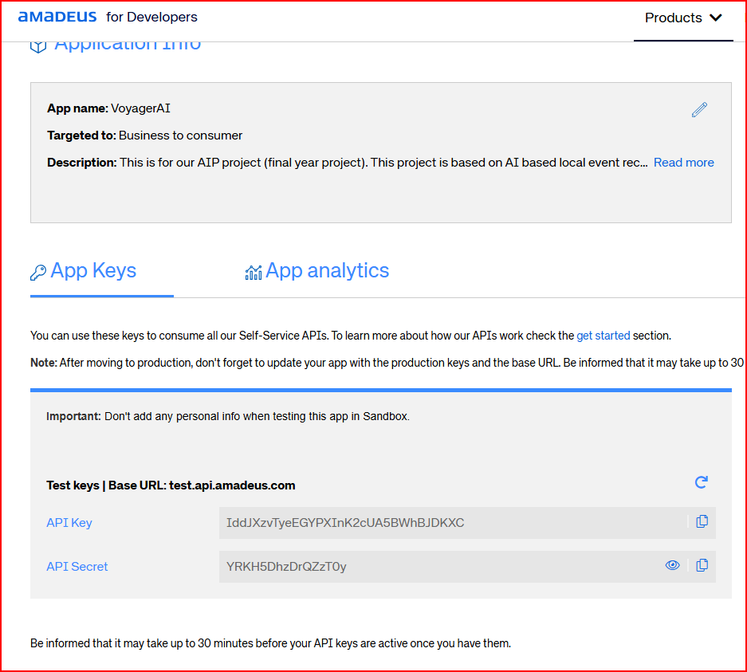

# VoyagerAI

## Virtual-Environments

> python -m venv v_venv (here v_venv is the name of virtual env)

## Backend

> *FLASK*

> install requirement: libraries | depedencies
> install -r requirements.txt

## Frontend

> *NEXTjs*

# Amadeus API (hotels, flights, iteneries)
